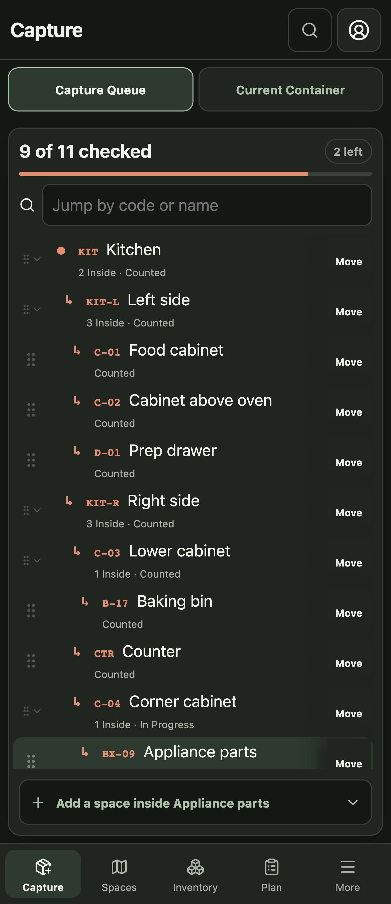
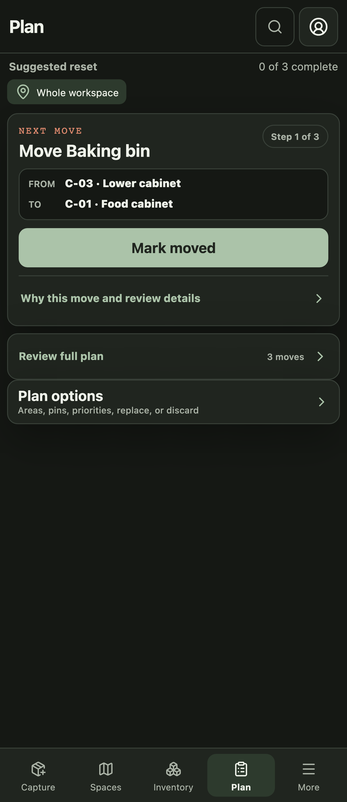
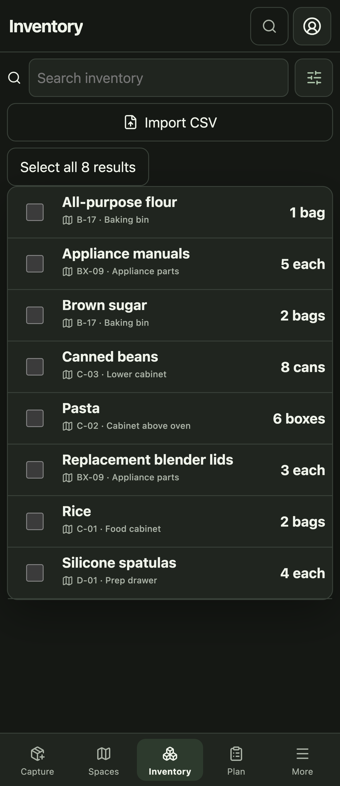
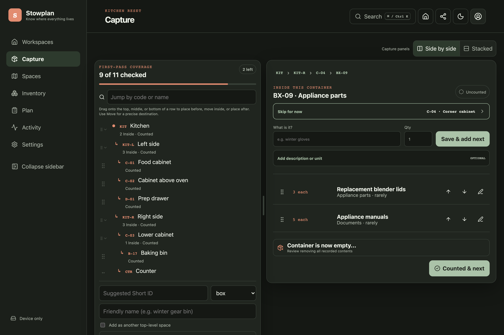
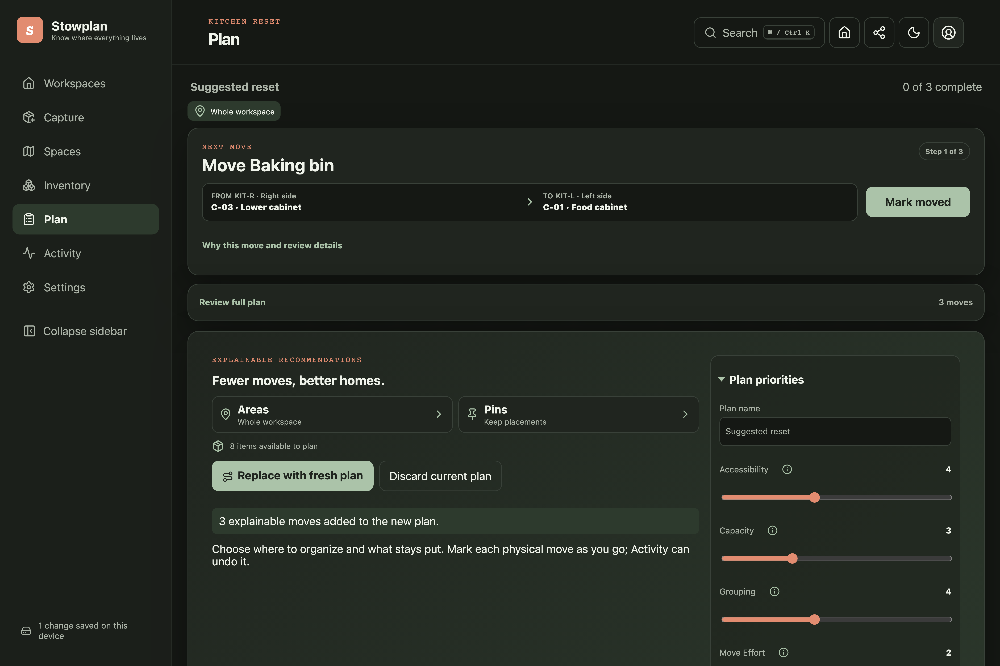
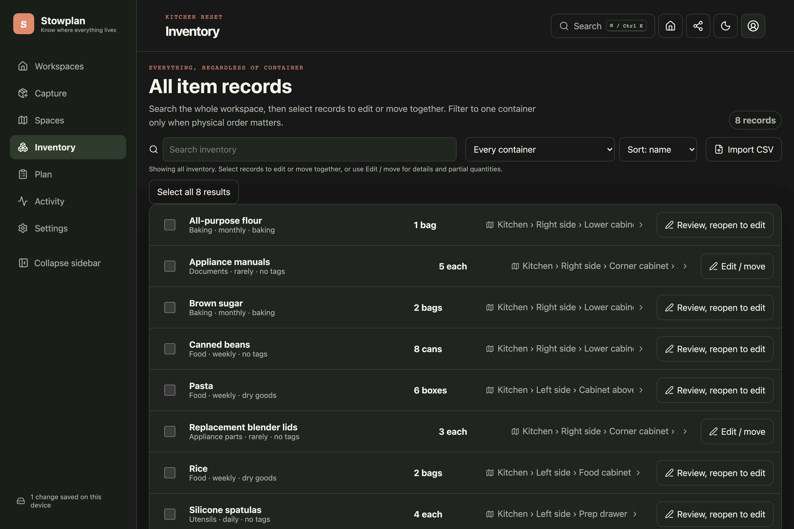

# Stowplan

[](https://github.com/j-256/stowplan/actions/workflows/ci.yml)
[](https://docs.stowplan.lasers.app/)
[](https://github.com/j-256/stowplan/releases)
[](LICENSE)
[](.nvmrc)

A mobile-first, local-first organizer for rooms, cabinets, drawers, boxes, bins, and every container inside them. Label physical spaces, perform a fast first-pass count, search structured inventory, generate explainable move plans, and keep working through connectivity or server failures.

[Try the ready-made kitchen](https://stowplan.lasers.app/demo) or read the [user guide](https://docs.stowplan.lasers.app/guide/getting-started). The demo needs no account and does not replace another workspace already stored in the browser.

<table>
  <tr>
    <td align="center" width="33%">
      <br>
      <b>Capture</b><br>
      <sub>Walk a container at a time, counting as you go.</sub>
    </td>
    <td align="center" width="33%">
      <br>
      <b>Plan</b><br>
      <sub>Weighted priorities and an explainable move plan.</sub>
    </td>
    <td align="center" width="33%">
      <br>
      <b>Inventory</b><br>
      <sub>Search every space at once, not box by box.</sub>
    </td>
  </tr>
</table>

<details>
<summary>The same views on a desktop</summary>







</details>

## Why Stowplan

- Container-first onboarding distinguishes uncounted, in-progress, known-empty, and counted spaces.
- Name-first item capture with a default quantity, optional descriptions and units, nested-container creation, and "mark counted & next" are optimized for a phone in one hand.
- IndexedDB is the immediate source of truth; a durable outbox batches and retries authenticated server backups.
- Connected workspace members see committed edits within five seconds under normal connectivity, without idle polling.
- Multiple local workspaces are preserved; scanner-safe guest links open shared workspaces without erasing the current one.
- Hierarchical moves are cycle-safe; partial quantities split/merge; bulk moves are atomic.
- Item and space editors expose structured attributes, conditions, dimensions, partial moves, archive/delete review, drag-and-drop, and equivalent touch/keyboard controls.
- Plans account for warmth, humidity, food safety, dimensions, grouping, access, distance, and whole-container moves.
- Field-level history supports selected undo/reapply ("plucking") and batch undo/redo without overwriting newer same-field edits.
- Blocked offline work remains inspectable and exportable; an explicit recovery flow can rebase unresolved commands or reset to an authorized server copy.
- Public Google sign-in is protected by Managed Turnstile; Cloudflare Access remains an independent admin-only perimeter around database-authorized administration.
- Short one-time guest URLs, opaque revocable sessions, bounded public resource allocation, workspace roles, and an audited admin panel are built in.
- Production runs on Sites with a Sites-managed D1 binding. Direct Cloudflare Workers + D1, Node 24 + SQLite, and containers remain reproducible alternative composition roots.

## Quick start

```bash
nvm use
npm ci
npm run dev
```

The pinned Node 24 LTS release is the deployment default. Node 26 is also verified in CI. Both use npm 11, which is required for the committed lockfile.

Open the local URL and choose **Open kitchen demo**. Local organizing requires no provider credentials.

`npm run dev` applies pending local D1 migrations first, so an existing `.wrangler/` database picks up schema added since it was created. Set `STOWPLAN_SKIP_DEV_MIGRATIONS=1` to start without touching the database; server-backed sign-in and sync need the current schema. To test Node-backed sync:

```bash
npm run build:next
AUTH_BASE_URL=http://localhost:3000 \
AUTH_DEV_ENABLED=true \
AUTH_IDENTITY_DIGEST_KEY=stowplan-local-identity-digest-key-not-for-production \
npm run start:node
```

See the [getting-started guide](https://docs.stowplan.lasers.app/guide/getting-started) and [deployment matrix](https://docs.stowplan.lasers.app/deploy/).

## Repository map

```text
app/                 Next.js UI and standard Request/Response API routes
src/domain/          Deterministic model, commands, planner, import validation
src/client/          IndexedDB replica, outbox, sync scheduling, UI
src/server/          Persistence/auth/admin ports and services
src/adapters/        D1 and Node SQLite adapters
migrations/          Ordered durable schema migrations
docs/                VitePress user, operator, maintainer, and agent docs
cloudflare/          Parameterized Access, WAF, and rate-limit desired state
worker/              Hibernating live-collaboration relay for Cloudflare
scripts/             Build, smoke, deployment, and reconciliation automation
tests/               Domain, sync, adapter, offline, and auth tests
```

## Verify

```bash
npm ci
bash scripts/verify.sh
```

CI runs exactly this sequence, so a local pass reproduces it. CI and release also validate the deployment automation and build the release artifacts, which a release then publishes:

```bash
bash scripts/deploy-checks.sh
bash scripts/release-artifacts.sh
```

Both need no credentials and reach no network, so they run on every push rather than first executing when a tag is already published.

The GitHub Pages workflow derives the deployment base from the Pages site metadata; the release gate validates both the project subpath and domain root. The application production deployment is Sites, while GitHub Pages serves the canonical documentation at `docs.stowplan.lasers.app`. The [Cloudflare runbook](https://docs.stowplan.lasers.app/deploy/cloudflare) separates reproducible Sites artifact preparation and connector handoff from direct Cloudflare bootstrap, Access, WAF, rate-limit, migration, secret, deploy, backup, and recovery commands.

## Security and privacy

Inventory is private application data. APIs are uncached and workspace-scoped; session values, provider tokens, Access assertions, guest URLs, secrets, and production exports must never be logged or committed. Read the official hosted service's [privacy policy](https://stowplan.lasers.app/privacy) and [SECURITY.md](SECURITY.md) before reporting a vulnerability.

## Contributing

Read [CONTRIBUTING.md](CONTRIBUTING.md) and [AGENTS.md](AGENTS.md). Changes must preserve offline durability, deterministic commands, field-aware conflicts/history, server-side authorization, and mobile accessibility.

## License

Stowplan is a Strange Lasers project. It is licensed under `AGPL-3.0-only`. Network operators of modified versions must offer the corresponding source for the running version. Copyright © 2026 James Klein (j-256).
